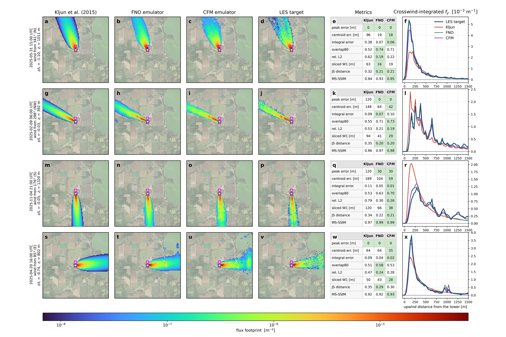

# flux-kegonsa

**A site-calibrated flux-footprint emulator for the UW-Madison Kegonsa Solar Array
eddy-covariance tower.** It takes the six scalars the Kljun et al. (2015) footprint model
takes and returns, in milliseconds, the two-dimensional footprint that a large-eddy simulation
of this site would produce. The training targets are 1366 FastEddy large-eddy simulations with a
backward Lagrangian particle model, one per day over five years, forced by real HRRR analyses.

## The result

On the untouched 2025 test split (294 cases), both emulators beat Kljun on every metric.

| model | peak distance RMSE [m] | centroid RMSE [m] | integral RMSE | overlap80 | rel. L2 | sliced W1 [m] | JS distance | MS-SSIM |
|---|---|---|---|---|---|---|---|---|
| Kljun | 104.0 | 129.3 | 0.240 | 0.548 | 0.565 | 75.0 | 0.359 | 0.937 |
| FNO | 33.1 | 92.8 | 0.184 | 0.604 | 0.365 | 53.5 | 0.292 | 0.937 |
| **CFM** | **30.6** | **69.3** | 0.190 | 0.604 | **0.359** | **40.9** | **0.286** | **0.941** |

Full tables, floors and figures: [results](emulator/results.md).

## What is in this documentation

| section | for |
|---|---|
| [Getting started](getting-started/quickstart.md) | installing, fetching the assets from Hugging Face, running the emulator, running one LES case |
| [Problem and approach](problem/motivation.md) | why a site-calibrated footprint, what the pipeline is, what the model knows about the site |
| [LES pipeline](les/fasteddy-and-patches.md) | FastEddy and the six patches, the grid, the seed library, how a case is generated, the LPDM and the footprint estimator, the gates, deployment on rented GPUs |
| [Corpus](corpus/dataset.md) | the dataset, its splits, flags and gaps, and how to read the figures |
| [Emulator](emulator/targets-and-architecture.md) | the target design, the FNO and the CFM, training and selection, results, calibration |
| [Limitations and future work](limitations-and-future-work.md) | the twelve things to state wherever this work is described |
| [Development history](history/overview.md) | nine passes on four grids: every decision, what was tried, and why it failed |
| [Reference](reference/repository-layout.md) | the repository, every script, the standing rules, the FastEddy traps, what was ruled out, a glossary |

## Scope, stated

One tower, one grid, no transfer. The model receptor is at 30 m while the instrument is at
10 m, a resolution decision. There are no stable cases, so the emulator is undefined at night.
Only about 15% of the corpus has the solar array in the footprint, and the northerly subset is
where the site-specific skill lives. Every one of these is explained in
[motivation](problem/motivation.md) and quantified in [limitations](limitations-and-future-work.md).

## Cite

Atharva Tyagi, *flux-kegonsa: an LES-trained flux-footprint emulator for the Kegonsa Solar Array
eddy-covariance tower*, 2026. `CITATION.cff` in the repository. Code Apache-2.0; the vendored
Kljun FFP under its own ISC-style licence; FastEddy Apache-2.0.
