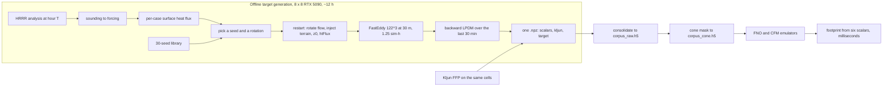

# Method overview

## The generator

Each training pair is one LES run.

| stage | what | file |
|---|---|---|
| 0 | a seed: a pre-spun flat turbulence state of the right regime, depth and heading, from a library of 30 | `seeds/`, `bin/run_seed.sh` |
| 1 | the HRRR pseudo-sounding at the tower for hour T | `bin/hrrr_sounding.py` |
| 2 | that sounding fitted to FastEddy's four-segment base state, plus the geostrophic wind, surface flux and `dt` | `bin/sounding_to_forcing.py` |
| 3 | this case's per-cell virtual heat-flux map from the land-cover classes and the hour's Bowen ratio | `bin/case_surface.py` |
| 4 | which seed, and which of its four 90° rotations | `bin/pick_seed.py` |
| 5 | the seed's flow rotated and the static surface (terrain, `z0`, `htFlux`) written into the restart file | `bin/prep_restart.py` |
| 6 | FastEddy: 30 minutes of adjustment under the case's own forcing, then a 30-minute sampling window handed to the LPDM in RAM | `bin/run_window.sh`, patch 0005 |
| 7 | the backward LPDM: particles released at the receptor through the window, followed back to their touchdowns; the signed footprint on the LES's own 122 × 122 cells | `bin/stage5_footprint.py`, `lpdm/` |
| 8 | the record: the six scalars measured over the same window, the official Kljun footprint on the same cells, the LES footprint | `bin/make_pair.py` |

Details: [configuration](../les/configuration.md), [seed library](../les/seed-library.md),
[case generation](../les/case-generation.md), [LPDM and footprint](../les/lpdm-and-footprint.md).

The pipeline is validated by gates that assert on the artifacts each stage produces, never on
exit codes or on the configuration handed in ([gates and diagnostics](../les/gates-and-diagnostics.md)).
It runs on rented multi-GPU machines from one Docker image with the code and the seed library
baked in ([deployment](../les/deployment.md)).

## The corpus

1366 cases, one per day over 2021–2026, hour drawn at random from each day and screened for
an unstable, quasi-stationary boundary layer between 300 and 1250 m deep. Split by calendar
year: 2024 is validation, 2025 is test. Two HDF5 files with identical layout: `corpus_raw.h5`
as produced, and `corpus_cone.h5` with the periodic wraparound cropped by a wind-aligned cone
whose one parameter was measured from an empty valley in the mass distribution. Only about
15% of records have the array in view. [The dataset](../corpus/dataset.md).

## The emulators

Both take Kljun's six scalars and the Kljun raster, work in `asinh` space on the 128² padded
frame, and are conditioned by FiLM.

- **FNO**: predicts a residual on Kljun; a zero residual reproduces Kljun to 7.5e-8. 28.4 M
  parameters, five seeds, ensemble mean. Selected by a 120-trial Optuna study and a final round
  that removed a low-level haze with a small L1 term.
- **CFM**: conditional flow matching from the noised Kljun prior to the LES target, a
  2.95 M-parameter U-Net velocity field. Its sample mean ties the FNO; its samples give the
  realisation spread, and the array share comes with an error bar.

[Targets and architecture](../emulator/targets-and-architecture.md), [training](../emulator/training.md),
[results](../emulator/results.md), [calibration](../emulator/calibration.md).

## The reference model

Kljun's FFP v1.42 is vendored unmodified (`third_party/FFP/`) and evaluated on the LES raster's
own cell edges by `lpdm/kljun_ffp.py`, which agrees with the code it wraps to 9.4e-16. Kljun is
the input channel, the residual's anchor, the baseline every metric is scored against, and the
source of the `σ_y` that defines the cone. The project's earlier own reimplementation was
1.25× wide in `σ_y` in the near-neutral regime and was retired.

## Scales

| | |
|---|---|
| LES cell | 30 m; 122 × 122 × 122 cells, 3660 m domain, receptor at 30 m (28.5 m aerodynamic) |
| one case | 1.25 simulated hours, about 0.36–0.5 GPU-h on an RTX 5090 |
| one seed | 2.0 simulated hours, 0.189 GPU-h/sim-h at 16-way |
| the corpus | 1366 pairs, about 12 hours on 64 GPUs, 76 MB of HDF5 |
| the emulator | 28.4 M (FNO) or 2.95 M (CFM) parameters; 7–13 min per seed to train on an RTX 4080; milliseconds per footprint |

## Provenance chain

Every record carries the image commit that made it, the seed and rotation it restarted from,
the seed's stationarity verdict, the grid, the closure configuration and the FFP version. The
corpus image is pinned by digest; FastEddy by release tag plus a patch series with a
checksummed manifest; the emulator's environment by `ml/environment.yml`; and every corpus
read by the emulator code is logged, so the single audited read of the test split is on
record.
